<div align="center">

# Laboratory Work No. 2

[Русский](README.md) 丨 **English**

</div>


## Problem

Given axis-aligned rectangles whose corners have integer coordinates in `[1, 10⁹] × [1, 10⁹]`, answer the query “How many rectangles contain point `(x, y)`?” as quickly as possible while keeping preprocessing time low.

Only the lower boundaries are included:

$$x_1 \le x < x_2, \qquad y_1 \le y < y_2.$$


## Example

Rectangles: `{(2,2),(6,8)}`, `{(5,4),(9,10)}`, `{(4,0),(11,6)}`, `{(8,2),(12,12)}`.

| Point | Answer |
|---|---:|
| `(2, 2)` | 1 |
| `(12, 12)` | 0 |
| `(10, 4)` | 2 |
| `(5, 5)` | 3 |
| `(2, 10)` | 0 |
| `(2, 8)` | 0 |


## Algorithms

| Algorithm | Preprocessing | Query | Description |
|---|---:|---:|---|
| `brute` | O(1) | O(N) | No preprocessing; checks every rectangle for each query. |
| `map` | O(N³) | O(log N) | Coordinate compression followed by construction of a two-dimensional map. |
| `tree` | O(N log N) | O(log N) | Coordinate compression and a persistent segment tree. |


## Measurement stability

The benchmark method is validated separately with three identical control workloads. This detects material bias caused by system noise, execution order, cache warm-up, or inconsistent data availability. See the [measurement-control report](debag/README_EN.md).


## Test-data generation

The dataset contains nested rectangles whose coordinate step is greater than one. For every $i$ from 1 to $N-1$:

$$x[0][0] = (10i, 10i),$$

$$x[1][1] = (10(2N-i), 10(2N-i)).$$

The number of query points $M$ is constant. Points are generated pseudo-randomly and distributed approximately uniformly over the non-empty intersection of the rectangles:

$$x_i = (P_1 i)^{31} \bmod (20N),$$

$$y_i = (P_2 i)^{31} \bmod (20N),$$

where $P_1$ and $P_2$ are different large prime numbers.
The hash function $(P i)^{31} \bmod m$ provides the pseudo-random distribution of points.


## Running the project

Run all algorithms, rebuild both root reports, and render the shared language-neutral charts:

```bash
./scripts/run_tests.sh -run -all
```

Run the same workflow in Docker:

```bash
docker compose run --rm lab2
```

On Linux, if Docker creates files with the wrong owner, create `.env` first:

```bash
printf 'UID=%s\nGID=%s\n' "$(id -u)" "$(id -g)" > .env
```


## Benchmark results

### Preprocessing time

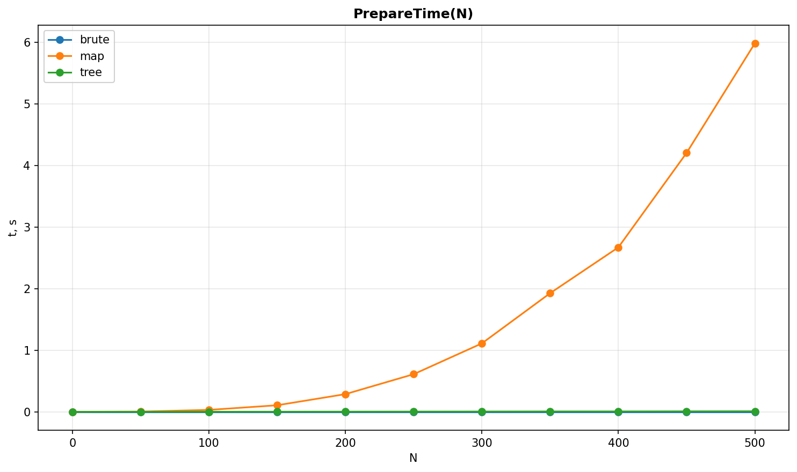

The map dominates the linear scale, so a second chart omits it to make the brute-force and tree preprocessing times visible.

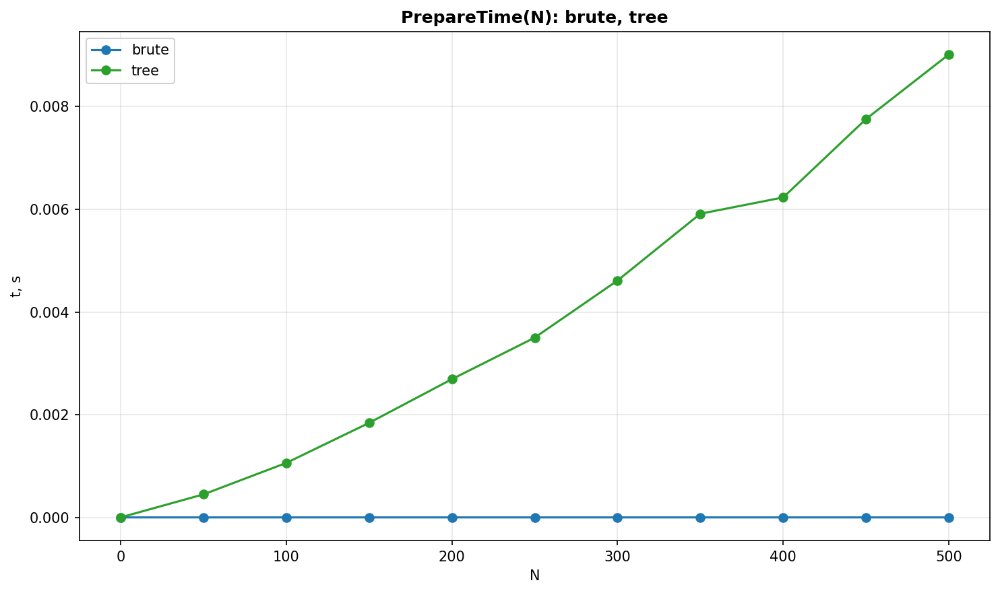

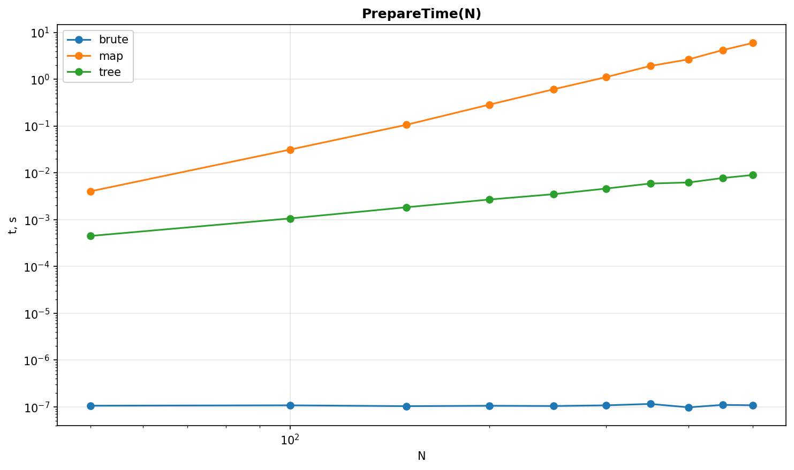

### Query time for one point

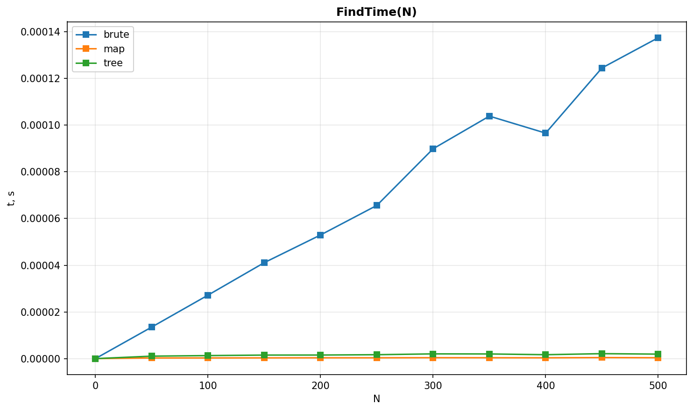

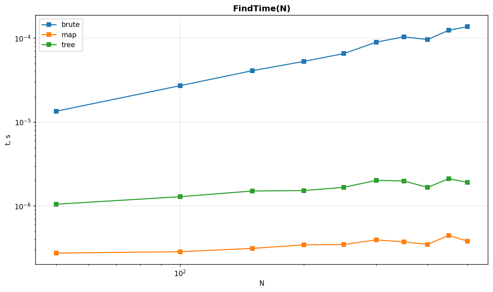

The following chart omits brute force to expose the difference between map and tree queries.

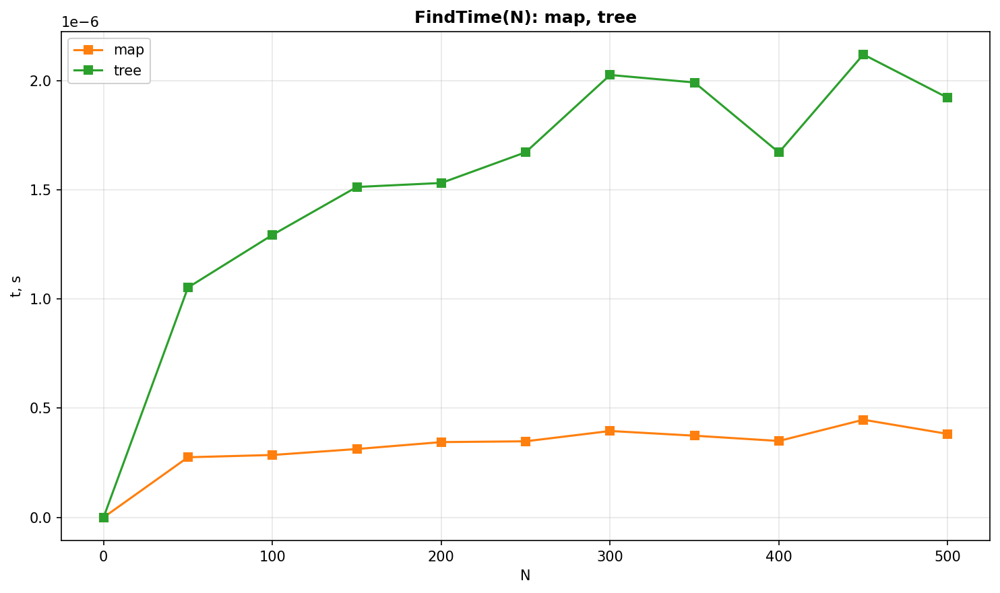

### Combined log-log chart

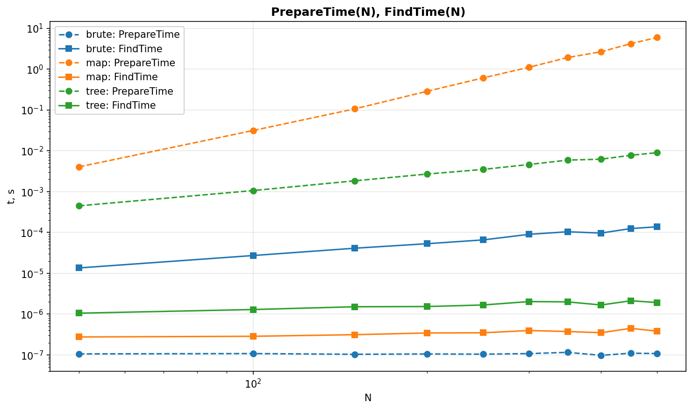


## Total running time

For $N$ rectangles and $M$ query points, total time is estimated from temporary benchmark results as

$$t(N,M) = \operatorname{PrepareTime}(N) + M \cdot \operatorname{FindTime}(N).$$

### Fixed number of queries

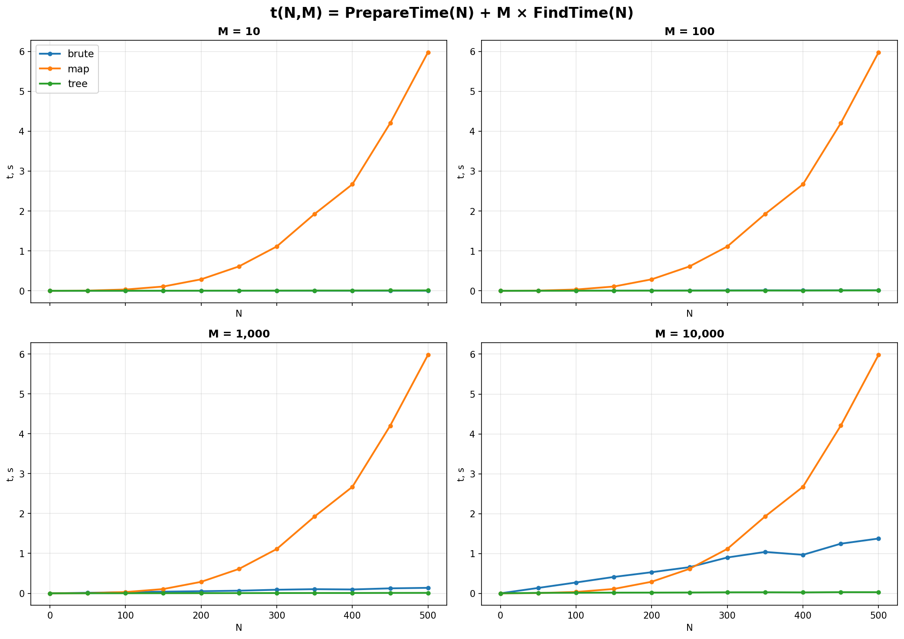

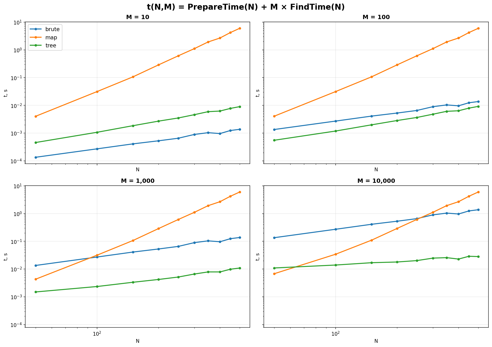

### Fixed number of rectangles

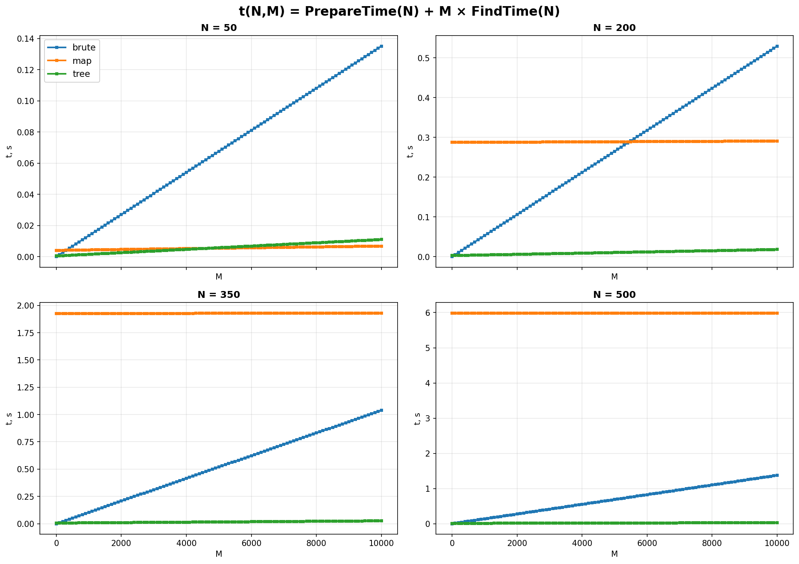


## Regions where each algorithm is optimal

For algorithms $A$ and $B$, the crossover point satisfies

$$\operatorname{PrepareTime}_A(N) + M\operatorname{FindTime}_A(N)
= \operatorname{PrepareTime}_B(N) + M\operatorname{FindTime}_B(N),$$

therefore

$$M(N) = \frac{\operatorname{PrepareTime}_B(N)-\operatorname{PrepareTime}_A(N)}
{\operatorname{FindTime}_A(N)-\operatorname{FindTime}_B(N)}.$$

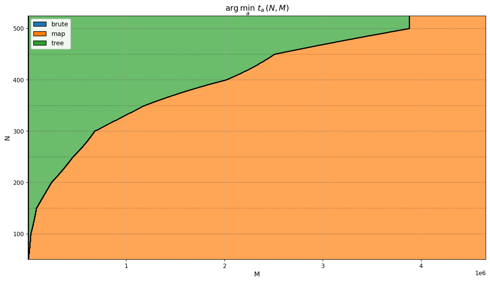

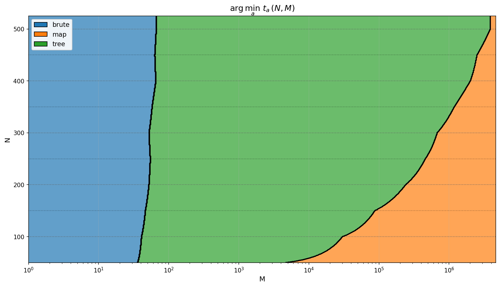


## Conclusion

The fastest choice is generally:

- brute force when $M$ is small;
- the two-dimensional map when $M$ is extremely large;
- the persistent segment tree for most intermediate cases.

<details>
<summary>Approximate empirical models</summary>

- **Brute:** `PrepareTime = 9.64e-08`, `FindTime = 2.04e-07 × N`
- **Map:** `PrepareTime = 2.81e-08 × N³`, `FindTime = 4.22e-08 × log₂(N)`
- **Tree:** `PrepareTime = 1.47e-06 × N × log₂(N)`, `FindTime = 1.75e-07 × log₂(N)`

</details>


## Generated files

| Command | Updated files |
|---|---|
| `./scripts/run_tests.sh -run` | `README.md`, `README_EN.md`, and `tests/report/resources/*.png` |
| `./scripts/run_tests.sh -run -all` | `README.md`, `README_EN.md`, and `tests/report/resources/*.png` |
| `./scripts/run_debag.sh` | Both debag READMEs and `debag/reports/resources/*.png` |
| `./scripts/build_reports.sh main|debag|all` | Reports and charts from already-created temporary CSV files |
| `./scripts/create_archive.sh` | `release.zip` |
| `./scripts/build_docker.sh` | Local Docker image `lab2:latest` |
| `./scripts/release.sh` | All preceding release stages in sequence |

Intermediate JSON and CSV files exist only while a command is running and are removed afterward.
