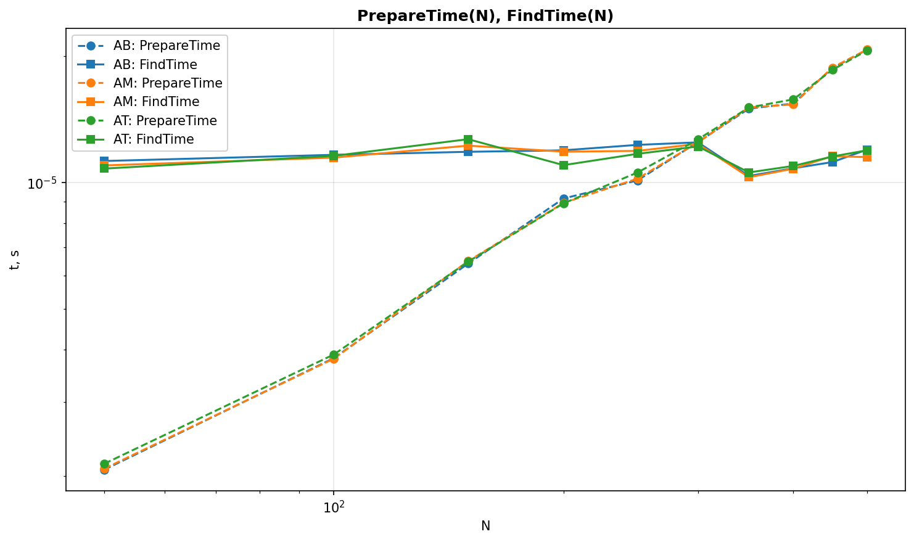
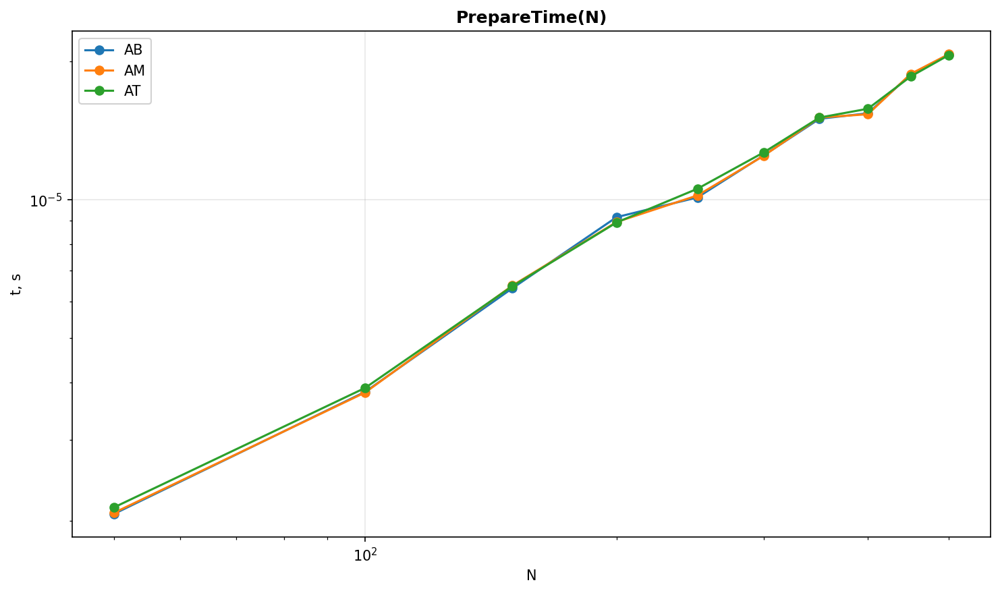
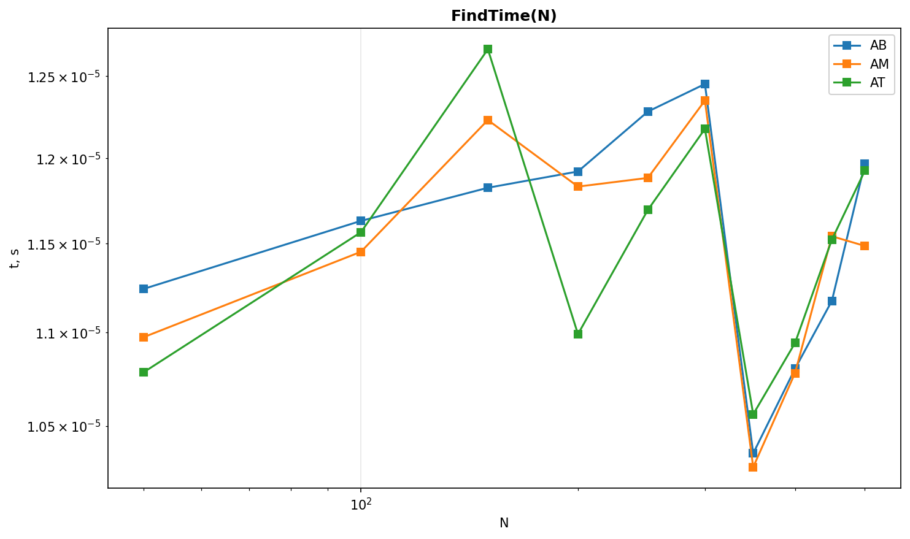
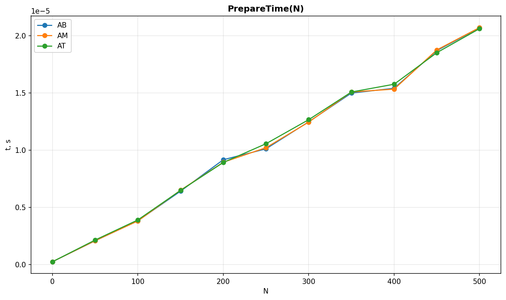
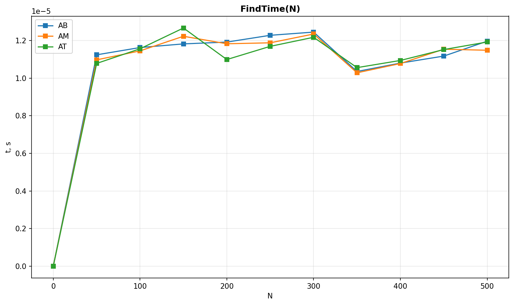

<div align="center">

# Measurement Stability Controls (`debag`)

[Русский](README.md) 丨 **English**

</div>

[← Main report](../README_EN.md)


## Purpose

This suite validates the benchmark method, not the correctness of the production algorithms. The three control modules `fake_ab`, `fake_am`, and `fake_at` run exactly the same deterministic workload under different names. A material difference between their measurements therefore indicates system noise, execution-order bias, cache warm-up effects, or inconsistent data availability.

The runner:

- rotates the order of algorithms between preprocessing measurements;
- warms up query calls before collecting samples;
- disables garbage collection during query timing;
- discards the outer 20% of query samples and takes the median;
- uses multiple preprocessing runs and their median;
- checks that all controls return the same value for every point.

After the benchmark, `debag/verify_results.py` computes the median relative spread between controls for every measured $N$. The run fails if preprocessing or query spread exceeds 5%.


## Running the controls

```bash
./scripts/run_debag.sh
```

The command creates temporary CSV files, validates their spread, updates both reports and the shared charts, and then removes the intermediate data.


## Log-log charts

Power functions appear as straight lines on log-log axes; their slope corresponds to the exponent of the measured complexity. For example, a slope of 1 represents O(N), while a slope of 3 represents O(N³).








## Linear-scale charts

The linear scale shows the absolute timing differences that logarithmic axes compress.





<!-- measurement-results:start -->
## Latest verification result

| Metric | Measured spread | Limit | Status |
|---|---:|---:|---|
| Preparation | 2.0% | 5% | passed |
| Query | 3.6% | 5% | passed |

**Result: passed.**
<!-- measurement-results:end -->


## Interpretation

The three lines should remain close because the workloads are identical. Passing the 5% threshold does not prove that the machine is completely noise-free, but it rules out instability large enough to materially distort the comparison of the production algorithms. A failed run should be discarded and repeated under a quieter system load.

